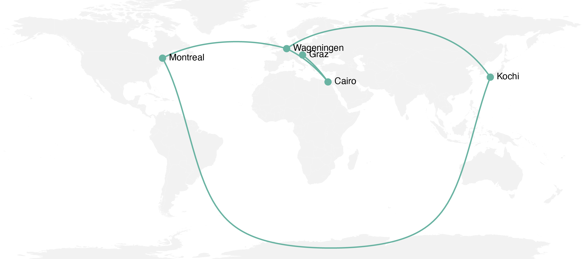
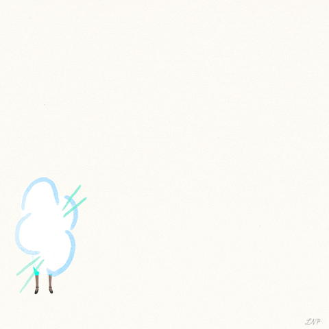
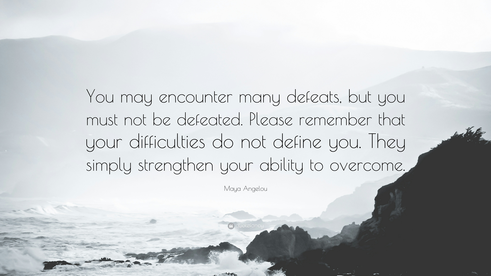

```{css, echo = FALSE}
.tiny .remark-code { /*Change made here*/
  font-size: 50% !important;
}

.small .remark-code { /*Change made here*/
  font-size: 80% !important;
}

th { font-size: 12px; }
td { font-size: 12px; }

# b, strong {
#    color: black;
# }

.remark-slide tr:nth-child(2n) {
  background-color: white !important;
}

.footnote {
  font-size: 10pt;
  margin-bottom: -11.6px;
  margin-left: 10px;
}

```

```{r xaringan-themer, include=FALSE, warning=FALSE}
library(xaringanthemer)
style_mono_accent(
  base_color = "#69b3a2",
  header_font_google = google_font("Josefin Sans"),
  text_font_google   = google_font("Montserrat", "300", "300i"),
  code_font_google   = google_font("Fira Mono")
)
```

### There isn't just one way

<br>

<p align="center">
  
</p>

<br>

.footnote[source: Unsplash
] 

---

class: middle, center 

#Let's take a [poll](https://fast-poll.com/poll/c3e49653)! 

---

### My (non)linear path from academia to industry

<br>
</br>

<p align="center">
  
</p>

---

class: middle, center 

### But what's the right path for me? 

<p align="center">
  
</p>

.footnote[source: Unsplash
] 

---

### What are your superpowers?

What are your key skills (technical and interpersonal)? (ask your PhD supervisor, colleagues, friends etc. - be aware of gender bias!)

<p align="center">
  
</p>

.footnote[[Breaking barriers: Unconscious gender bias in the workplace](https://www.ilo.org/wcmsp5/groups/public/---ed_dialogue/---act_emp/documents/publication/wcms_601276.pdf)
] 

---

### To do list

2. Write a short summary about yourself (who are you, what are you passionate about?)

3. Make a list of your main accomplishments (have you won a prize, any grants etc.?)

4. Prepare your resume/CV

5. Make a website to showcase your skills/portfolio (check out my <a href="https://ruthschmidt.rbind.io"> website</a>) - don't underestimate having your own website (tip: <a href="https://summer-of-blogdown.netlify.app/">Summer of Blogdown</a> by Alison Presmanes Hill (RStudio Educator))

---

### What's in a resume? 


- Academic vs. industrial (what's the difference?)

- You have less than 7 seconds to make an impression! 

- Focus on the most important points (summary, title and current position, previous title and company incl. dates, skills, education)

- Choose an accessible format (e.g. <a href="https://github.com/yihui/xaringan">xaringan</a> for R enthusiasts)

- Think of something to stand out (website, portfolio, blog post)

- 2 pages max. (for industry)

- Let's look at an example

---

### What's in a cover letter? 

- Address a person if info available (look them up)

- How did you hear about the position?

- How does your qualification and personality (!) and passion (make a link) fit to the description? 

- Explain your background and link to position description (be honest - don't oversell and don't undersell yourself, again be aware of gender bias!)

- Highlight only most relevant qualifications

- 1 page max. (for industry)

- Same format as resume

---

### Getting help with your resume/cover letter

1. Writing services (e.g. Monster resume, general and more for industry, often US-focused) 

2. Have colleagues, former/current supervisors in industry/academia look over it (the more diverse the better)

4. Ask for examples from colleagues, people with similar career objectives

3. Feedback is essential!

---

### Where to look for jobs?

- Big sites (LinkedIn, Glassdoor, Nature Jobs, Indeed, [Euraxess](https://euraxess.ec.europa.eu/career-development/researchers/discover-careers-beyond-academia), specific job sites, e.g. [UNJobs](https://unjobs.org/search)) 

- Social Media (Twitter, [RLadies](https://rladies.org/), Email lists, e.g. [BBClist Digest](https://maillist.psb.ugent.be/mailman/listinfo/bbclist)) 

- Look for companies that interest you and apply (even if there is no opening)

- (Virtual) Networking (Meetups, Uni events, connect with people on LinkedIn)

- Got your own product idea? Join an incubator (e.g. [Utrecht Inc.](https://utrechtinc.nl/))

- Do an internship (e.g. UN, company)

- Apply for grants/industrial (postdoctoral) fellowships that help you transition (e.g. [Novartis Fellowship](https://www.novartis.com/our-science/postdoc-program/novartis-innovation-postdoctoral-fellowship))

- Personal Connections!

- Keep track of your applications and check back if no reply

---

class: middle, center

<!-- ### Resources -->

<!-- - Build your own website: <a href="https://summer-of-blogdown.netlify.app/">Summer of Blogdown</a> by Alison Presmanes Hill (RStudio Educator) -->

<!-- - Startups in NL: Utrecht Inc.,  -->

<!-- --- -->

### Don't give up! 

<p align="center">
  
</p>

.footnote[source: Quotefancy
] 
---

class: middle, center

# Keep in touch

`r icon::fa("paper-plane")`<a href="mailto:schmidt.ruth@gmail.com">&nbsp;schmidt.ruth@gmail.com</a><br>
`r icon::fa("globe")`<a href="https://ruthschmidt.rbind.io">&nbsp;ruthschmidt.rbind.io</a><br>
`r icon::fa("twitter")`<a href="http://twitter.com/RuthLSchmidt">&nbsp; @RuthLSchmidt</a><br>
`r icon::fa("github")`<a href="http://github.com/ruthlys">&nbsp; @ruthlys</a><br>

.footnote[Slides created via the R package <a href="https://github.com/yihui/xaringan">xaringan</a>.
] 